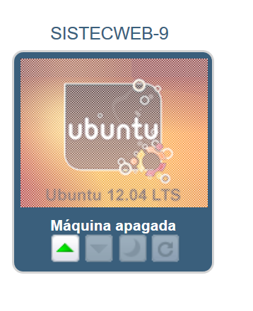
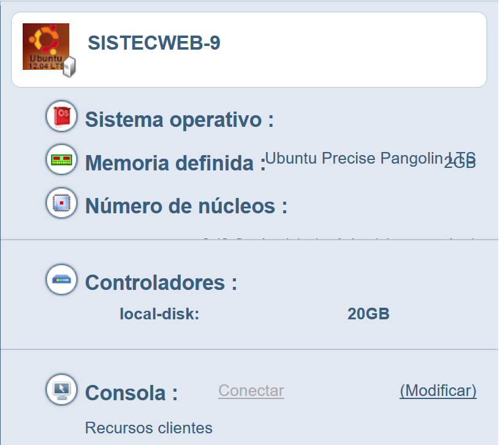
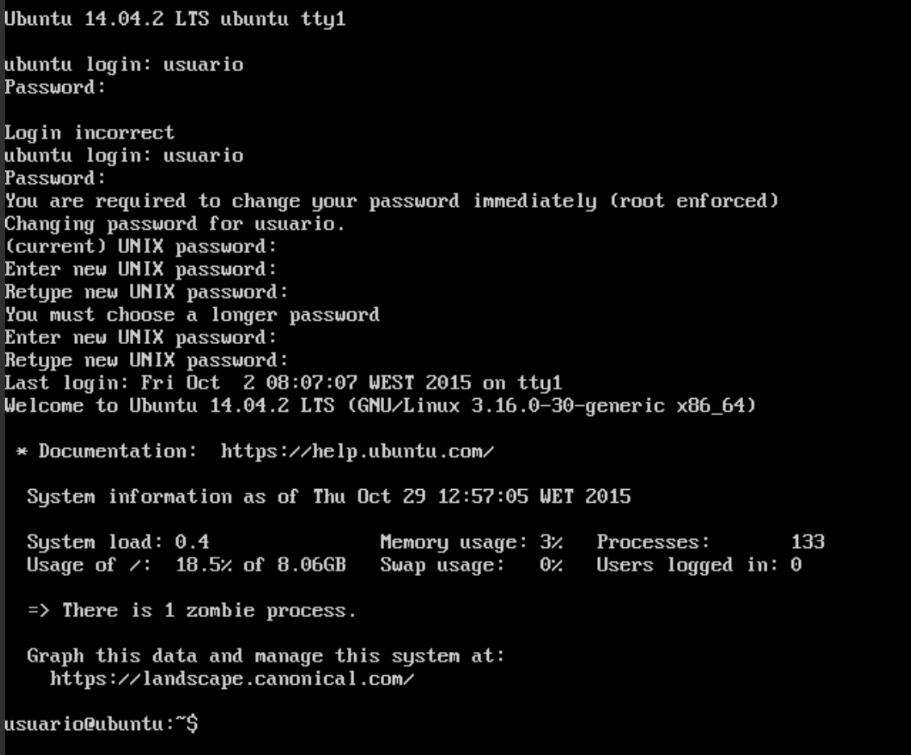
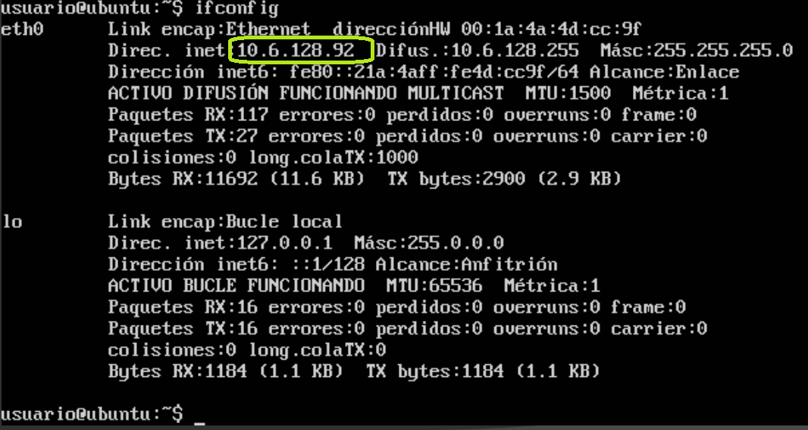
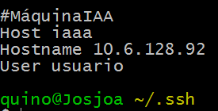
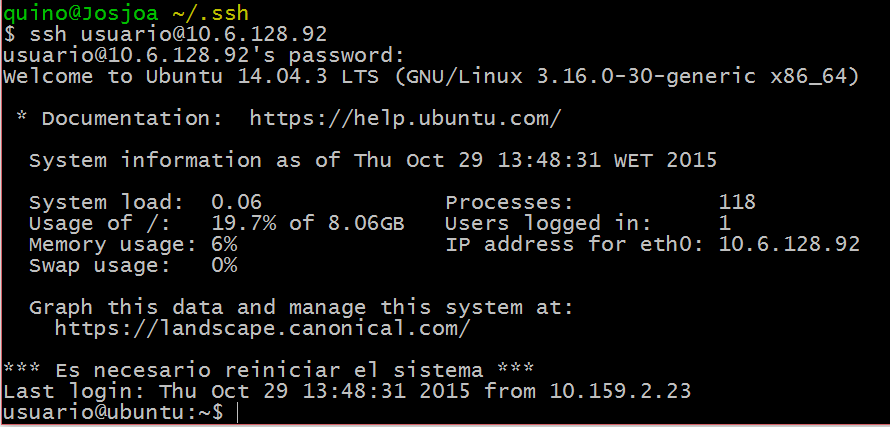
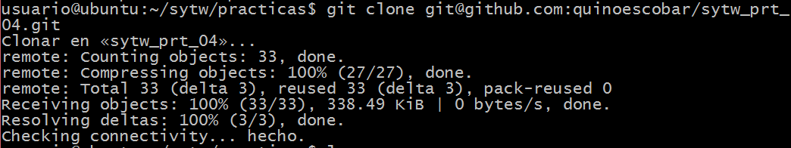
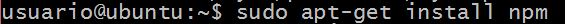
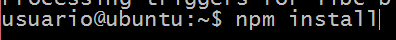
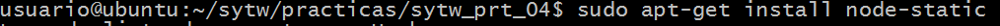

# Práctica 4- Contenido

Este repositorio contiene la tercera práctica de la asignatura Sistemas y Tencologías Web desplegada en IAAAS.

La práctica consiste en desplegar el conversor de temperaturas de grados Celsius a grados Farenheit, utilizando IAAAS de la Universidad de la Laguna.

# Tutorial Despliegue en IAAAS

## 1. Acceso a IAAAS
Se accedió a la página Enlace página práctica [iaaas.ull.es](http://iaas.ull.es/) y se inició sessión con la cuenta universitaria Alu0100XXYYZZ con su correspondiente contraseña.

Se comprobó que existiera la máquina virtual: 
Figura 1.

En la Figura 2, se pueden observar las especificaciones de la máquina virtual asignada:

Figura 2.

Se procedió a Encender la máquina virtual y ejecutar la consola, como se puede ver en la Figura 3.

Figura 3.

## 2. Dirección IP
Se ejecutó el comando:

          $ ifconfig
Se obtuvo la dirección IP , ver Figura 4.

Figura 4.

Con la dirección IP identificada, se procedió a añadir en la máquina local un alias para las conexiones, ver Figura 5  :

          $ ~.ssh/config

Figura 5.

Se comprobó la conexión desde la terminal local:

Figura 6.

## 3.Actualización
Se realizó una actualización de la máquina virtual:

Figura 7.
## 4. Clonación
Se clonó el repositorio de la práctica 3 :

Figura 8.
## 5. Instalación
Se instaló en la máquina virtual Node Package Manager:

Figura 9.

Al finalizar la instalación de npm, se procedió a instalar todos los paquetes necesarios para el funcionamiento de nuestra aplicación:

Figura 10.

Se instaló node-static, ya que es necesario para el funcionamiento del servidor y no se encontraba en las dependencias de la aplicación:

Figura 11.
## 6. Arrancando servidor

Al finalizar la instalación de las dependencias de la aplicación, se procedió al levantamiento del servidor con el comando:

          $ nodejs static-server.js

Para accedió a la página de la aplicación de la siguiente manera:

          direccionIP:puerto/ruta

          e.g.:http://10.6.128.92:8080/index.html
# Enlaces

Enlace página práctica [Cálculadora temperatura](https://quinoescobar.github.io/sytw_prt_04)

Enlace página Desplegada [Cálculadora temperatura](http://10.6.128.92:8080/index.html)

Enlace test de la práctica [Cálculadora temperatura](http://10.6.128.92:8080/tests/)

Enlace página author [Quinoescobar](https://quinoescobar.github.io)
